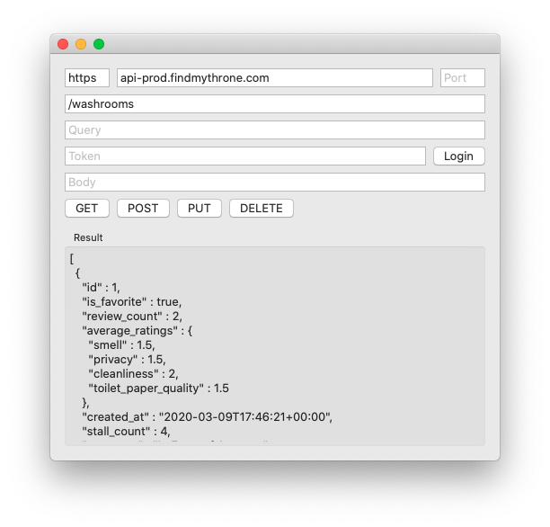
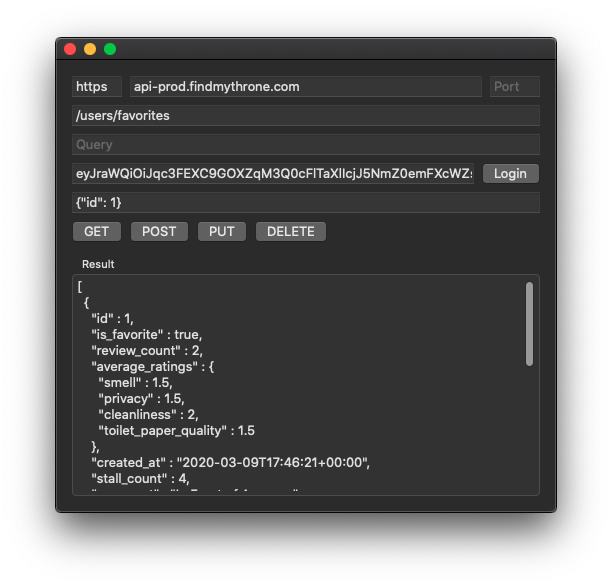

# Iron Throne

Iron Throne is a macOS application to test the REST API of Throne. It allows you to send custom authenticated requests to the Throne API.

Throne is a web and mobile application which allows users to find nearby washrooms tailored to their preferences and requirements. Throne presents up-to-date information by enabling users to provide feedback and information on the washrooms they visit.

Throne Component | Repository | Project Board
------------ | ------------- | ------------
All Components | - | [User Stories](https://github.com/DiljotSG/Throne-Backend/projects/1)
Backend | [Throne-Backend](https://github.com/DiljotSG/Throne-Backend) | [Backend Tasks](https://github.com/DiljotSG/Throne-Backend/projects/2)
Web | [Throne-Web](https://github.com/DiljotSG/Throne-Web) | [Web Tasks](https://github.com/DiljotSG/Throne-Web/projects/1)
iOS | [Throne-iOS](https://github.com/NickJosephson/Throne-iOS) | [iOS Tasks](https://github.com/NickJosephson/Throne-iOS/projects/1)
Android | [Throne-Android](https://github.com/NickJosephson/Throne-Android) | [Android Tasks](https://github.com/NickJosephson/Throne-Android/projects/1)

## Screenshots

